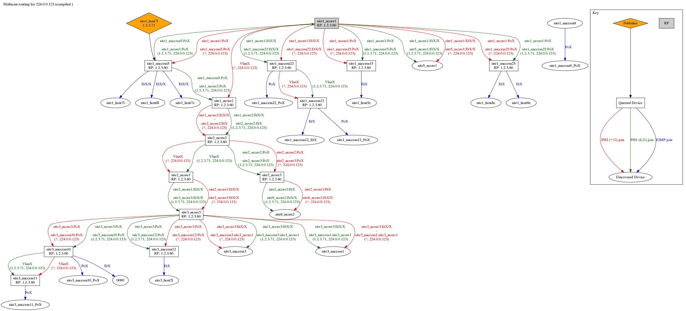

# ansible-multicast-graph

Visualises the multicast trees for a single IPv4 group address  using information
scraped from NX-OS, EOS and IOS devices using ansible, ntc-ansible and TextFSM.

It is capable of showing the following information (provided all relevant
devices are queried):

* The Rendezvouz Point device
* What every other device believes the RP to be (to help detect config mismatches)
* The direction of traffic flow on the shared multicast tree
* The direction of traffic flow on any source-specific multicast trees
* The publishes (IP addresses and name as discovered through LLDP)
* The subscribers (as discovered through IGMP Snooping and LLDP)



This tool is very young and could be significantly improved upon.
It was a first attempt at doing something useful while studying for Ivan Pepelnjak's
[Building Network Automation Solutions](http://www.ipspace.net/Building_Network_Automation_Solutions)
course.

## Quick start

* Clone this repository
* Initialise the ntc-ansible submodule:

```bash
git submodule update --init --recursive
```

* Create a python virtualenv and install the dependencies:

```bash
virtualenv env
source env/bin/activate
pip install -r requirements.txt
```

* Update the `hosts` inventory file with your own devices
* Create a vault file at `secrets/vault.yml` if you need ssh username and password
to access your devices, otherwise just create an empty file there:

```bash
ansible-vault create secrets/vault.yml
# or
touch secrets/vault.yml
```

* Run the tool for your chosen multicast group with:

```bash
ansible-playbook check_group.yml --extra-vars "mcast_group=224.0.0.123"
```

The rendered graph will be written to the `outputs` directory with the group
address as the filename and a .`.png` extension, e.g. `outputs/224.0.0.123.png`.

If you need to use a bastion host to connect to your network devices, uncomment the
line in `hosts` file, and change the hostname of the bastion host there. Also edit
`ssh_config` and set the right hostname there.

## Dependencies

* python (tested with 2.7 only)
* ansible (tested with 2.3)
* graphviz

This tool depends on several python libraries which are listed in the
`requirements.txt` file, which is intended to be used with a python virtualenv.

## How it works

The playbook has several stages (each of which is tagged and can be run separately):

* `setup` - Creates the output directories
* `fetch` - Fetches information from each device and writes them to separate output
files. This stage is split into mutiple sub-stages, each of which are written to
separate fiels.
** `fetch-interfaces` - Retrieves list of interfaces
** `fetch-lags` - Retrieves the list of link-aggregation groups
** `fetch-neighbours` - Retrieves the list of LLDP neighbours
** `fetch-rp` - Retrieves the Rendezvouz Point
** `fetch-mroutes` - Retrieves the list of mroutes
** `fetch-snooping` - Retrieves the list of IGMP subscribers
* `compile` - Merges the separate output files into a single report for easier
processing
* `generate` - Generates the dot graph from the compiled report
* `render` - Renders the output `png` image from the dot graph

The data is scraped from the devices using `ntc-ansible` and `ntc-templates`.
This tool ships its own modified copy of several of the TextFSM templates shipped
by ntc-templates which did not retrieve all of the necessary data. I intend to
upstream those modifications when time permits.

All of the business logic for calculating the list of devices and relationships
in the dot graph is done (ab)using jinja2 filters.

## Contributions

Pull requests are very much welcome!

